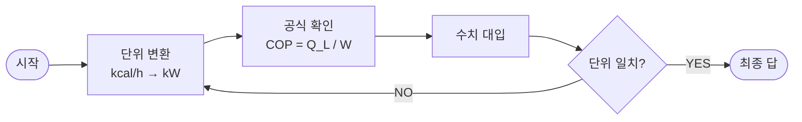

# 온유 스킬: 공조냉동 공식 풀이 도우미

## 핵심 원칙
- 원리 설명 금지. 풀이 순서와 공식만.
- ADHD 작업기억 최소화: 한 번에 1단계씩.
- 단위 변환 항상 첫 줄에 표시.

## 0단계: 문제 유형 분류
아래 유형 중 하나로 즉시 분류하라:
- **냉동능력/성적계수** (COP, Q, W)
- **냉매 사이클** (엔탈피, 압축비)
- **열전달** (현열, 잠열, 현열비)
- **배관/압력** (압력 강하, 유량)
- **기타** → search_vault("공조냉동 {키워드}") 호출

## 1단계: 순서도 출력 (Mermaid)
조건 분기 있는 문제는 graph TD, 순서만 있는 경우는 graph LR 사용.

예시 (냉동능력 문제):

실제 문제 풀이 시 위 구조를 문제에 맞게 채워서 출력하라.
단, Mermaid 렌더링이 안 되는 환경(터미널 출력)이면 기존 텍스트 순서도로 대체한다.

## 2단계: 계산 실행
- 숫자 대입은 수식과 함께 표시
- 중간 계산값도 단위와 함께 표시
- 최종 답: **굵게** + 단위 명시
- 공식 출처 표기:
  - Vault에서 찾은 공식 → `[출처: Vault RAG]`
  - Gemini 자체 지식 공식 → `[출처: AI 생성] ⚠️ 교재와 대조 권장`

## 3단계: 암기 키워드 (선택)
사용자가 "암기 팁도 줘"라고 하면:
- 공식을 한 줄 요약어로 변환
- 예: "COP = 냉동능력/압축일 → 얼마나 효율적?"

## 자체 검수
- [ ] 단위 변환을 첫 줄에 표시했는가?
- [ ] 풀이가 3단계를 초과하지 않는가?
- [ ] 원리 설명을 넣지 않았는가?
- [ ] 최종 답에 단위가 있는가?

## 🚨 피해야 할 실수
- "랭킨 사이클이란..." 식의 이론 설명 시작
- 단위 없이 숫자만 나열
- 풀이를 5단계 이상으로 복잡하게 나열
- 계산 실수 후 검산 생략
